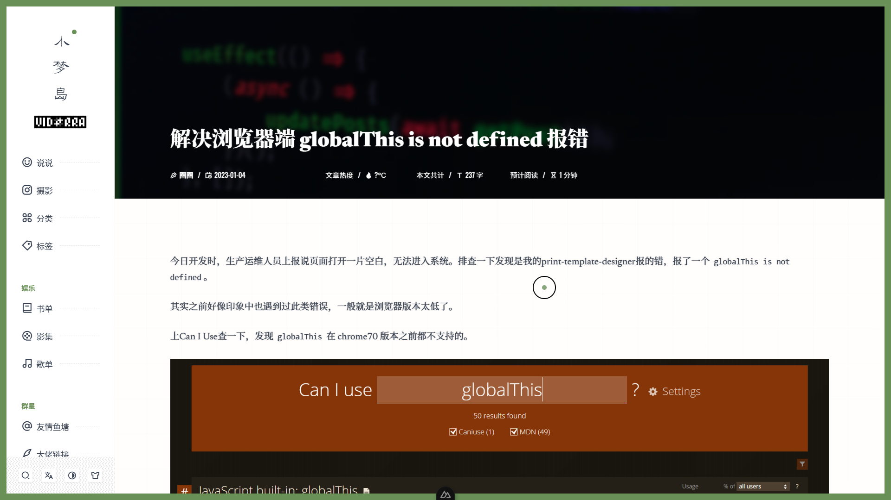

<h1>hexo-theme-vidorra</h1>

一款简洁好看的 hexo 博客主题

Awesome Nuxt3 + Hexo Blog Theme: <b>hexo-theme-vidorra</b> 

预览: 👍 [入口](https://dreamland-royians.netlify.app/) || 🤞 [preview](https://dreamland-royians.netlify.app/)

文档: 📖 [挖坑中，待完善](#)

## 开发计划

目前VIDORRA主题仍在开发中，随时点击[这里](https://dreamland-royians.netlify.app/)预览当前博客开发进度。

- ⚡ 冲冲冲-第一阶段-初步页面
  - [x] 首页
  - [x] 404页
  - [x] 博文页
  - [ ] 友链页（当前进度）
  - [ ] 500页
  - [ ] 分类页
  - [ ] 标签页
  - [ ] 摄影作品页
  - [ ] 说说页
  - [ ] 侧边栏
  - [ ] 关于页
  - [ ] 和pocketbase后端联动增加评论、主题配置功能

## 截图

## 项目结构

待完善

## 使用

待完善

### 安装

待完善

## 联系我

